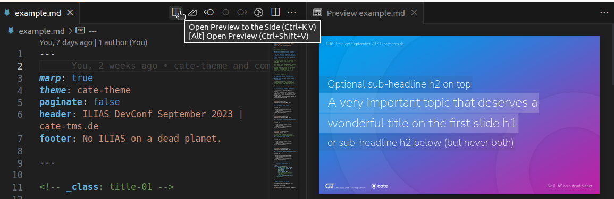
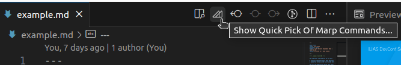

# Marp Template CaT / cate

This is our **CaT/cate presentation theme** for marp.

## Installation

We use VSCode and the official marp extension to export the finished presentations.

* Install VSCode from Ubuntu Software (https://snapcraft.io/code)
* Install the official marp extension (https://marketplace.visualstudio.com/items?itemName=marp-team.marp-vscode)

You can write your presentation in any text editor you would like. However, VSCode does offer a nice live preview that you can access by clicking the preview icon in the top right corner or press Ctrl + K, then V.



## Set up for your own presentation

Fork and branch this repo and use example.md as a base for your next presentation. You need to keep themes/, img/, fonts/, .vscode/ and their contents for the cate-theme to work.

## Export as html file

You can export your presentation as static HTML that no longer needs VSCode running by clicking on the marp icon in the top left corner or by opening VSCode's command palette with Ctrl + P and start typing ">Marp: Export Slide Deck...".



In the following dialog select HTML as the export format. Make sure the file name also has .html in the name and not .pdf.

If you distribute or upload the presentation, you need to keep the html file and the folders img/ and fonts/ inside the same location.

## Export as pdf file

PDF export works basically the same as exporting HTML.

If you get an error message while exporting PDF, you can make an HTML export instead, open it in the browser, start printing with Ctrl + P and choose "Save as PDF". The PDF is of course completely standalone and doesn't require any other files.

## Making a presentation

You can find a complete overview of the marp specific markdown syntax in the official documentation: https://marpit.marp.app/markdown

### Front Matter

To make sure that marp (and VSCode if used for a live preview) can properly handle this theme, you have to start your presentation markdown file with some front matter.

Header, footer and pagination can be set to your liking.

```markdown
---

marp: true
theme: cate-theme
paginate: false
header: ILIAS DevConf September 2023 | cate-tms.de
footer: No ILIAS on a dead planet.

---
```

### New Slide

In marp, you write your presentation in a markdown document. Use `---` to mark the break for the next slide.

```markdown
Slide 1

---

Slide 2
```

### Use Markdown

On the slide, you can use markdown for some visual structure:

```markdown
# Headline Slide 1

This is just a normal paragraph.

* some
* bullet
* points

---

Slide 2
```

### Special Slides

This cate-theme has special slide templates for the title and chapter slides that can be selected for the current slide like so:

```markdown
<!-- _class: title-01 -->

# **Headline on this cover slide**
```

The underscore in `_class` scopes this template style for this current slide only.

**The `**` bold markdown around the entire headline text is needed so the headline css styling works correctly on this slide template.** In the future the python script may be able to enforce this, but for now, you will have to make sure they are there!

### Images

See example.md for some example code of how to deal with images.

If you add more images you may want to place them in the img/ folder. This way you can grab them together with the logo files that are already stored there when you distribute the presentation.

Background images should be at least 1080 px high to not look pixelated. However, an image that is 720 px high will already fill 100% height of the slide as marp assumes a coordinate system of 1280 x 720 units.

All information for how to deal with images both inline and for the slide background can be found in the marp documentation: https://marpit.marp.app/image-syntax

## (Re-)compiling the theme

You can use the Python script `compile-sass.py` to compile the theme's style code. This is usually only necessary if you changed the scss file or want to change one of the preset flags.

The script assumes that you have dart-sass installed from the Ubuntu software snap store.

Compiling themes/cate-theme.scss without using the script is not recommended as the css needs a line attached to the beginning to work in marp.

From inside this folder, you can call the script like this:

```bash
python3 compile-sass.py
```

You will be prompted to set the following flag:
* set if inactive bullet points should fade to gray true/false (this modifies scss first, then compiles)

You can also take all default options like so:

```bash
python3 compile-sass.py --all-default
```

This script no longer exports the presentation. Please use VSCode with the official marp extension instead.