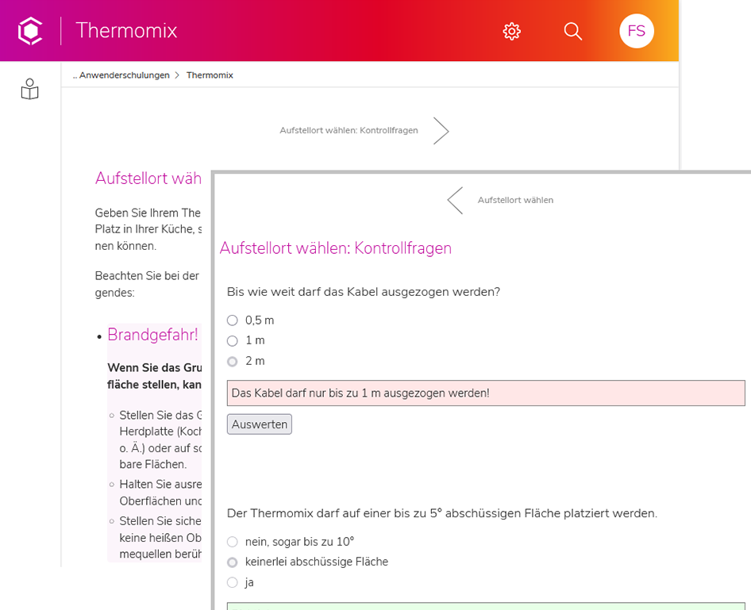
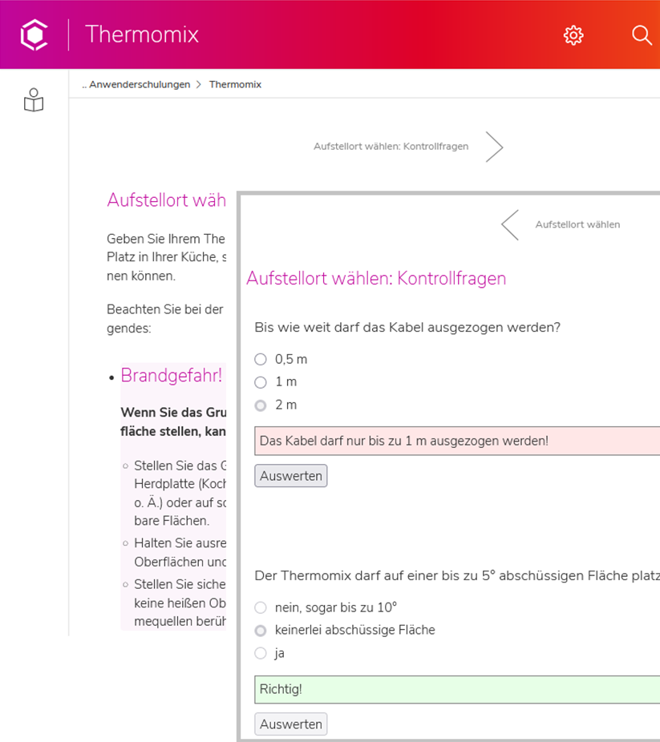
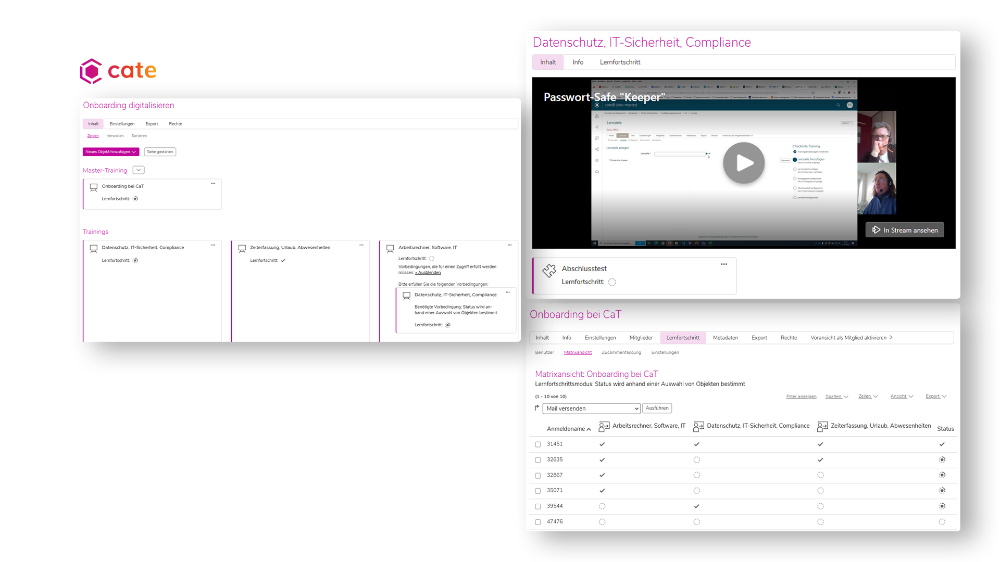

---

marp: true
theme: cat-theme-dark
paginate: false
header: Webinar - Digitalisierung für KMU 
footer: CaT Concepts and Training GmbH

---

<!-- _class: title cat -->

## **Dark Theme**

# **CaT Title Slide Template**

---

<!-- _class: title cate -->

## **Dark Theme**

# **cate Title Slide Template**

---

<!-- _class: chapter cat-->
### **CaT**
## **Kapitel Slide Template**

---

<!-- _class: chapter cate-->
### **cate**
## **Kapitel Slide Template**

---

### 33% Spalte - 66% Inhalt 

* CaT Branding Spaltenhintergrund
* 33/66 Aufteilung

---

### 66% Inhalt - 33% Spalte

* CaT Branding Spaltenhintergrund
* 33/66 Aufteilung

---

### 33% Spalte - 66% Inhalt

* cate Branding Spaltenhintergrund
* 33/66 Aufteilung

---

### 66% Inhalt - 33% Spalte

* cate Branding Spaltenhintergrund
* 33/66 Aufteilung

---

<!-- _class: chapter cat-->
### **50/50 Aufteilung**
## **Spalte/Inhalt**

---

### 50% Spalte - 50% Inhalt

* CaT Branding Spaltenhintergrund
* 50/50 Aufteilung

---

### 50% Inhalt - 50% Spalte

* CaT Branding Spaltenhintergrund
* 50/50 Aufteilung

---

### 50% Spalte - 50% Inhalt

* cate Branding Spaltenhintergrund
* 50/50 Aufteilung

---

### 50% Inhalt - 50% Spalte

* cate Branding Spaltenhintergrund
* 50/50 Aufteilung

---

<!-- _class: chapter cate -->

## **Bildverwendung**

---

---

---

<!-- _class: chapter cate -->

---

### Fragen?

---

<!-- _class: cate -->

### Kontakt
richard.klees@concepts-and-training.de
 

### Weitere Informationen finden Sie hier:

https://cate-lms.de
https://concepts-and-training.de

---

<!-- _class: cat -->

### Kontakt
richard.klees@concepts-and-training.de
 

### Weitere Informationen finden Sie hier:

https://cate-lms.de
https://concepts-and-training.de
