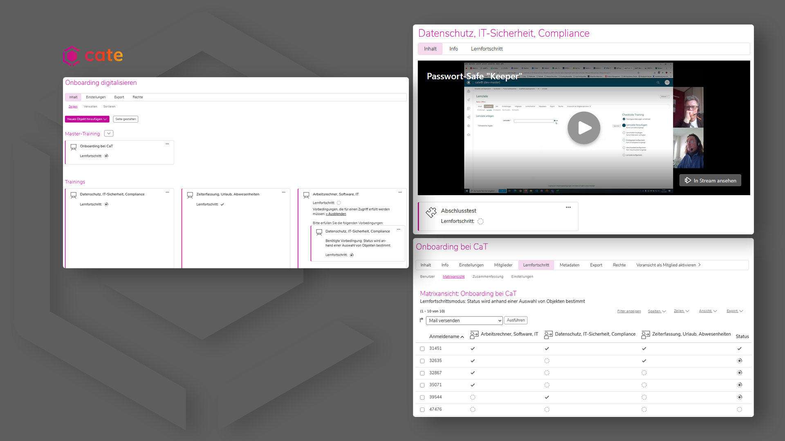

---

marp: true
theme: cat-theme-dark
paginate: false
header: Webinar - Digitalisierung für KMU 
footer: CaT Concepts and Training GmbH

---

<!-- _class: title -->

## **Dark Theme**

# **Markdown Template**

---

<!-- _class: chapter -->
### **33/66 Aufteilung**
## **Spalte/Inhalt**

---

### 33% Spalte - 66% Inhalt 

* CaT Branding Spaltenhintergrund
* 33/66 Aufteilung

---

### 66% Inhalt - 33% Spalte

* CaT Branding Spaltenhintergrund
* 33/66 Aufteilung

---

### 33% Spalte - 66% Inhalt

* cate Branding Spaltenhintergrund
* 33/66 Aufteilung

---

### 66% Inhalt - 33% Spalte

* cate Branding Spaltenhintergrund
* 33/66 Aufteilung

---

<!-- _class: chapter -->
### **50/50 Aufteilung**
## **Spalte/Inhalt**

---

### 50% Spalte - 50% Inhalt

* CaT Branding Spaltenhintergrund
* 50/50 Aufteilung

---

### 50% Inhalt - 50% Spalte

* CaT Branding Spaltenhintergrund
* 50/50 Aufteilung

---

### 50% Spalte - 50% Inhalt

* cate Branding Spaltenhintergrund
* 50/50 Aufteilung

---

### 50% Inhalt - 50% Spalte

* cate Branding Spaltenhintergrund
* 50/50 Aufteilung

---

<!-- _class: chapter -->

## **Bildverwendung**

---

---

<!-- _class: chapter -->

---

### Zeit für Fragen

---

### Kontakt
richard.klees@concepts-and-training.de
 

### Weitere Informationen finden Sie hier:

https://cate-lms.de
https://concepts-and-training.de

---

<!-- _class: chapter -->
### **Viele Wege führen nach Rom.**

## **Digitalisierung für KMU**

