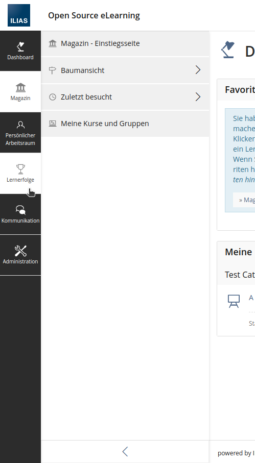
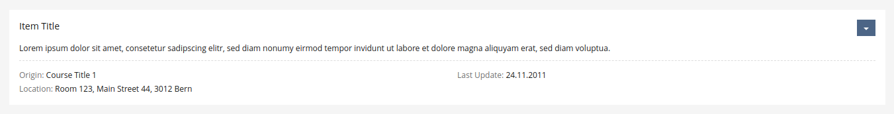

---

marp: true
theme: cate-theme
paginate: false
header: ILIAS DevConf September 2023 | cate-tms.de
footer: No ILIAS on a dead planet.

---

<!-- _class: title-01 -->

## **Optional sub-headline h2 on top**

# **A very important topic that deserves a wonderful title on the first slide h1**

## **or sub-headline h2 below (but never both)**

<!-- Comments like this are hidden on the slide, but show up in presenter mode (press P).

There should be no paragraph text on this title slide - only one h1 and h2 each.

Keep the headlines inside the `**` bold markdown - it's important for the css code of this slide type to work. -->

---

<!-- _class: chapter-01 -->

### **Optional Chapter Sub-Headline**

## **The title for this section of the presentation**

<!-- Keep the headlines inside the `**` bold markdown - it's important for the css code of this slide type to work. -->

---

### An interesting thing to talk about

* with this very important point to consider
* and here is another one that needs a couple lines of text to really make clear what it is all about and why whe whould consider this
* three bullet points is a good amount of bullet points for a slide

---


### A slide next to an image

It could be

* an impressive screenshot there
* a hilarious meme
* or a picture of a cute and cuddly kitten, because why not

---


### A slide with some more space for text

It could be

* an impressive screenshot there
* a hilarious meme
* or a picture of a cute and cuddly kitten, because why not

---



<!-- The "fit" parameter makes the background fit inside of the slide -->
### A slide next to an image

It could be 

* an impressive screenshot there
* a hilarious meme
* or a picture of a cute and cuddly kitten, because why not

---


### A slide with some more space for text

It could be

* an impressive screenshot there
* a hilarious meme
* or a picture of a cute and cuddly kitten, because why not

---

<!-- _class: chapter-02 -->

### **Optional Chapter Sub-Headline**

## **A second alternative chapter cover**

<!-- Keep the headlines inside the `**` bold markdown - it's important for the css code of this slide type to work. -->

---

# A slide with some code on it

```php
public function getRows(
        DataRowBuilder $row_builder,
        array $visible_column_ids,
        Range $range,
        Order $order,
        ?array $filter_data, // $DIC->uiService()->filter()->getData();
        ?array $additional_parameters
    ): Generator;
```

---

# Images inline on the slide



Images can be resized:

