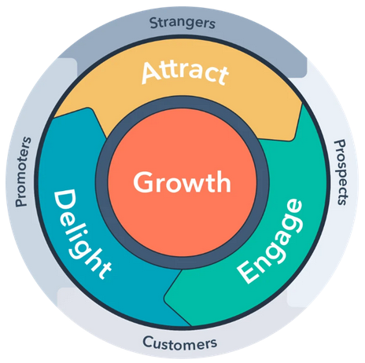
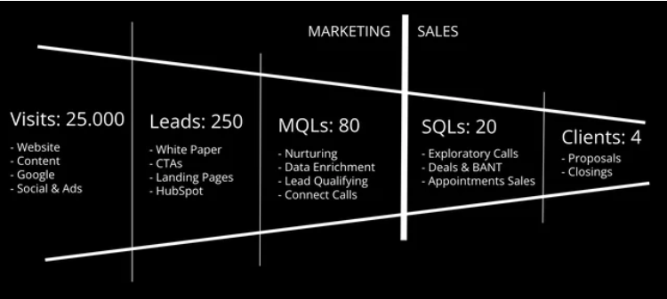

---

marp: true
theme: cate-theme
paginate: false
header: Inbound Marketing
footer: they ask, we (you) answer

---

<!-- _class: title-01 -->

## **Was ist ...**
# **Inbound Marketing?**
## **... und warum sollten wir das nutzen?**

<!-- Comments like this are hidden on the slide, but show up in presenter mode (press P).

There should be no paragraph text on this title slide - only one h1 and h2 each.

Keep the headlines inside the `**` bold markdown - it's important for the css code of this slide type to work. -->

---

### Was habe ich NICHT vor?

* keinen akademischen Vortrag halten
* kein Referat von pseudo-hippen Marketing-Trends
* keine ICP-Analysen oder Lead-Nuturing-Modelle propagieren
<!-- ICP: ideal customer profile Lead Nuturing: alle Schritte im Rahmen eines Lead Management Prozesses, die ein Unternehmen unternimmt, um Interessenten zur richtigen Zeit mit den für sie relevanten Informationen anzusprechen -->
* komplette Übersicht über das Thema geben
* auf Anglizismen verzichten (können)

---

### Was habe ich vor?

* warum Marketing?
* kurze Methodenübersicht
* Inbound Marketing als systematisch-strukturierte Vorgehensweise vorstellen
* spezielle Stategien zeigen, die auch kleineren Unternehmen mit wenig Budget helfen
* wie Verkaufsprozesse sinnvoll unterstützt werden können
* orientiert an unserem Status Quo und Möglichkeiten bei CaT
* ein wenig Marketing-Sprech einführen

---

*People don't care about you or your products. 
They just care about their own problems."*  
<!-- Menschen sind nicht an dir oder deinen Produkten interessiert, sie kümmern sich nur um ihre Probleme-->

*David Meerman Scott*
*(Online Marketing Stratege, Speaker, Autor)*

---

### Warum Marketing?

* Aufmerksamkeit für ein Produkt oder eine Dienstleistung wecken
* das Informationsbedürfnis von potentiellen Kunden erfüllen
* Kontakte generieren und qualifizieren
* Teildisziplin des Verkaufprozesses

---

### Marketing Ansätze allgemein (B2B)

* Cold Outreach
* Performance Marketing
* Inbound Marketing

---

### Cold Outreach

* potentielle Kunden oder Branchen werden über gekaufte od. gesammelte Kontaktadressen per Post, Telefon oder Email kontaktiert
* hohe Reichweite, aber durch breite Streuung u. U. sehr geringe Trefferquote von sales-qualified Leads
* interruptive, Kontaktpersonen werden "gestört"
* push-Prinzip

---

### Performance Marketing

* gekaufte Werbung auf digitalen Plattformen (Google, Social Media, Youtube)
* resourcenintensiv, weil teuer 
* hohe Reichweite, aber u. U. geringe Trefferquote

---

### Inbound Marketing

* Websites oder andere digitale Plattformen erreichen potentielle Kunden über qualitativ hochwertige und hilfreiche Inhalte
  *"People don't care about you or your products. They just care about their own problems."*
* imagefördernd, 
* langfristig und nachhaltig erfolgreich
* Multiplikatoreffekt
* pull-Prinzip

---

<!-- _class: chapter-01 -->

## **Inbound Marketing**

### **Im Detail**

<!-- Keep the headlines inside the `**` bold markdown - it's important for the css code of this slide type to work. -->

---

### Leads generieren und qualifizieren

* Businesskontakt der (im Idealfall) vom ersten Besuch der Website bis zum Kaufabschluss in seiner Customer Journey begleitet wird (Lead Nuturing)
* attract - engage - delight - Prinzip
* Marketing-qualified Leads
* Sales-qualified Leads

---

### Grundprinzipien

* über suchmaschinenoptimierten (SEO) hochwertigen Content gelangen möglichst viele Personen auf eine Website und konsumieren Inhalte (Onlineartikel od. Blogbeiträge -> CaT-/cate-Storys)

* der Content ist nicht werblich, sondern bietet nützliche Informationen, mit denen Kunden in vielen Fällen sogar selbstständig ein Problem lösen könnten.

* Unternehmen gewinnen so an Vertrauen und positionieren sich als Experte in ihrer Branche

---

### "they ask - you answer"-Prinzip

* potentielle Kunden begeben sich im Internet auf die Suche nach Informationen zur Lösung eines Problems
* über Websites, Blogs, Social Media Posts finden sie Informationen über Lösungsansätze
* welche Suchanfragen könnten gestellt werden?
* wie weit fortgeschritten ist die Customer Journey?
* welche Themen stehen ganz am Anfang, welche Fragen werden kurz vor einer Vertragsverhandlung gestellt

---

### Top-of-the-funnel-Content vs. Bottom-of-the-funnel-Content

* Content-Produktion braucht viel Ressourcen
* teuer und zeitintensiv
* Whitepaper vs. special interest-Themen
* high volume vs. low-competition-Themen
* hohe conversion-rate möglich
* Zielgruppe hat schon sehr viel vorrecherchiert und bekommt sehr spezielle Inhalte und Themen präsentiert

---

---

### was braucht Inbound Marketing?
* nicht quantitativ-hohe Besucherzahlen, sondern qualitative Kontakte (MQL)
* im Idealfall Personen mit Kaufinteresse als sales qualified Leads (SQL)
* Contentstrategie
* Content Manager
* Cluster Content
* Pillar Pages

---

<!-- _class: chapter-01 -->

## **Resumee**

<!-- Keep the headlines inside the `**` bold markdown - it's important for the css code of this slide type to work. -->

---

### Inbound Marketing 

* they ask - you answer-Prinzip als Leitbild
* nicht manipulativ, sondern an Lösungen orientiert
* werblichen Content vermeiden
* fachliche Expertise aufbauen und stärken
* längerfristig angelegte Content-Strategie
* Konzentration auf "bottom-of-the-funnel"-Themen

---

### was haben wir davon?
* ein klares und strukturiertes Verständnis des Bereichs
* Messbarkeit der Wirksamkeit
* Unterstützung für den gesamten Verkaufsprozess
* Verbesserung der Sichtbarkeit
* besseres Renommee

---

<!-- _class: chapter-01 -->

## **Diskussion**

<!-- Keep the headlines inside the `**` bold markdown - it's important for the css code of this slide type to work. -->

