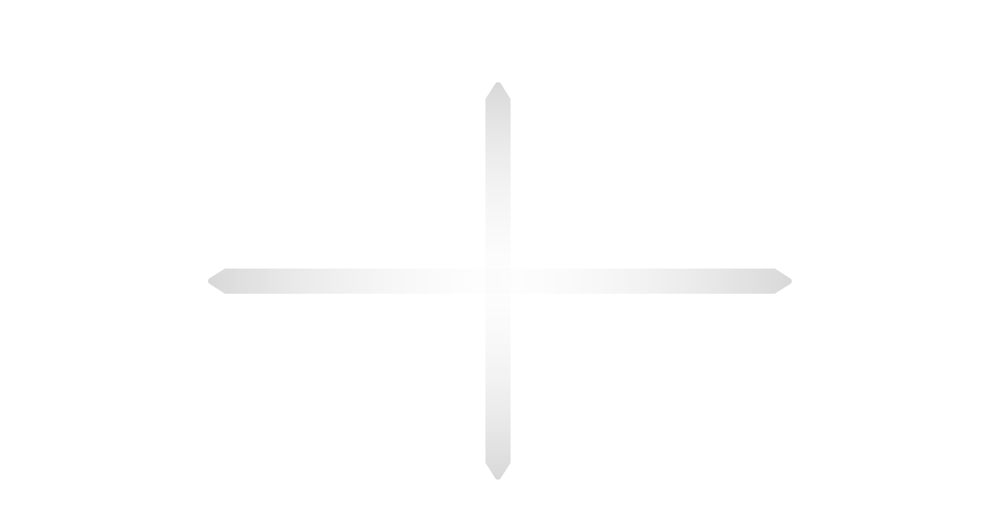
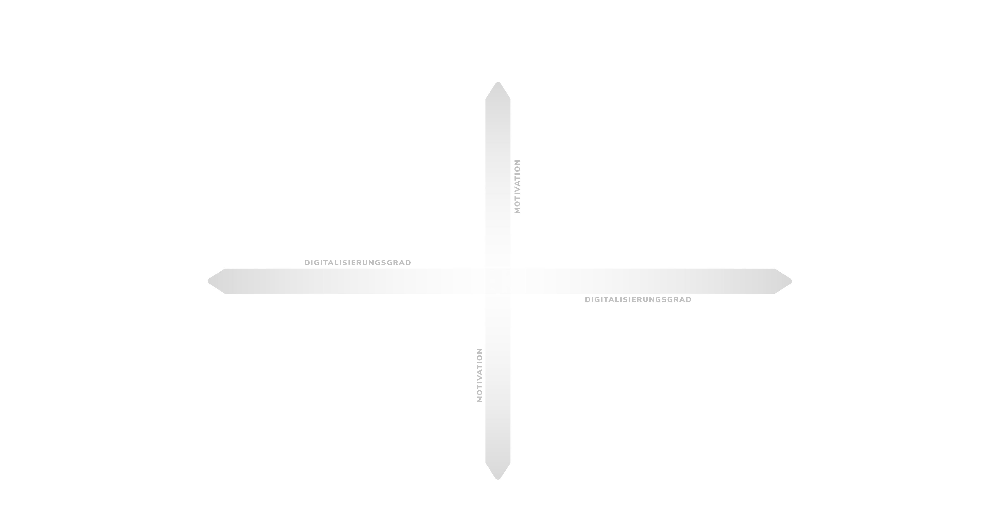
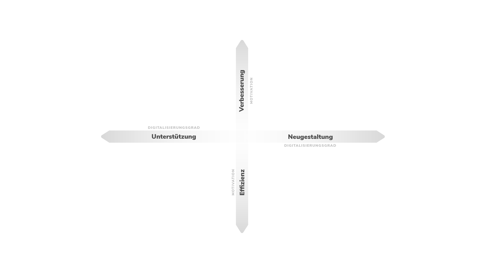
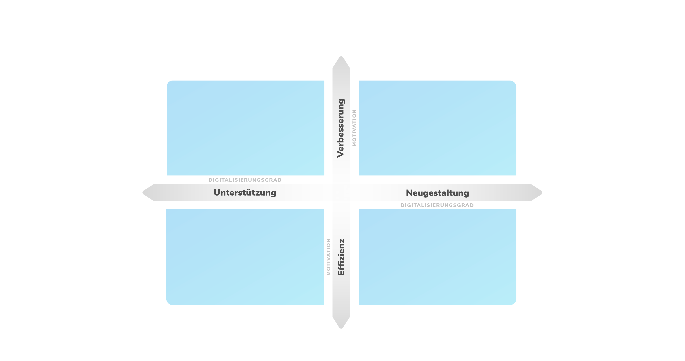
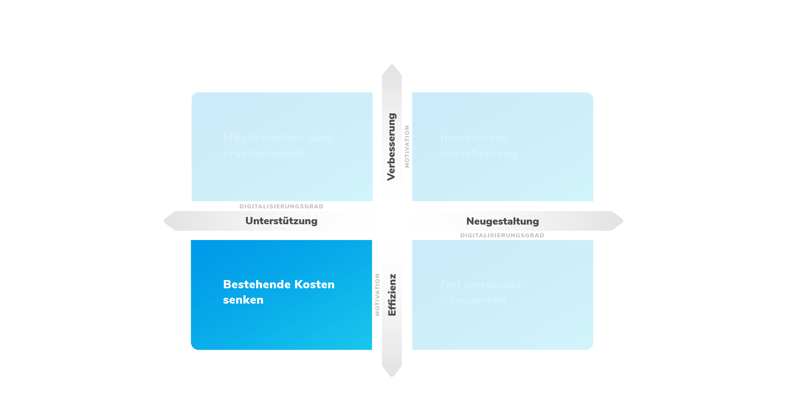
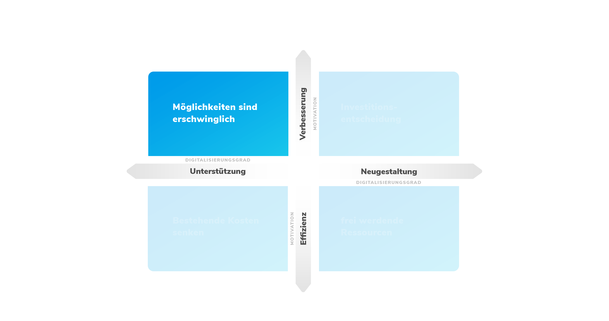
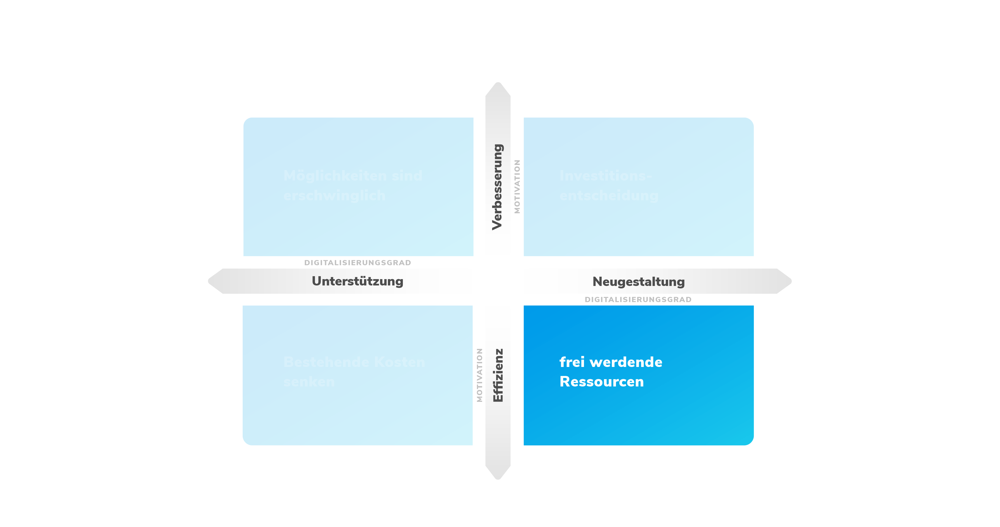
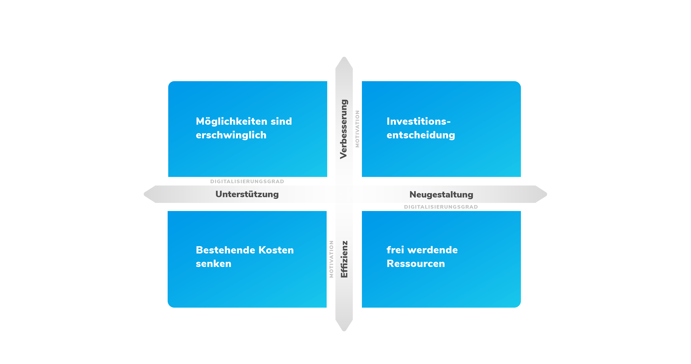

---

marp: true
theme: cat-theme-dark
paginate: false
header: 
footer: CaT-Webinar: Digitalisierung in KMU

---

<!-- _class: title -->

## **CaT-Webinar**

# **Digitalisierung in KMU**

<!-- Comments like this are hidden on the slide, but show up in presenter mode (press P).

There should be no paragraph text on this title slide - only one h1 and h2 each.

Keep the headlines inside the `**` bold markdown - it's important for the css code of this slide type to work. -->

---

<!-- _class: chapter -->

### **Teil 1:**

## **Die Digitalisierungsmatrix**

<!-- Keep the headlines inside the `**` bold markdown - it's important for the css code of this slide type to work. -->

---


<!-- _class: chapter -->

---


<!-- _class: chapter -->

---


<!-- _class: chapter -->

---


<!-- _class: chapter -->

---


<!-- _class: chapter -->

---


<!-- _class: chapter -->

---


<!-- _class: chapter -->

---


<!-- _class: chapter -->

---


<!-- _class: chapter -->

---

### **An interesting thing to talk about**

* with this very important point to consider
* and here is another one that needs a couple lines of text to really make clear what it is all about and why whe whould consider this
* three bullet points is a good amount of bullet points for a slide

---


<!-- _class: textbox -->

### An interesting thing to talk about

* with this very important point to consider
* and here is another one that needs a couple lines of text to really make clear what it is all about and why whe whould consider this
* three bullet points is a good amount of bullet points for a slide

---


### A slide next to an image

It could be

* an impressive screenshot there
* a hilarious meme
* or a picture of a cute and cuddly kitten, because why not

---


<!-- The "fit" parameter makes the background fit inside of the slide -->
### A slide next to an image

It could be 

* an impressive screenshot there
* a hilarious meme
* or a picture of a cute and cuddly kitten, because why not

---

## A slide with some code on it

```php
public function getRows(
        DataRowBuilder $row_builder,
        array $visible_column_ids,
        Range $range,
        Order $order,
        ?array $filter_data, // $DIC->uiService()->filter()->getData();
        ?array $additional_parameters
    ): Generator;
```

---

## Images inline on the slide


Images can be resized:


