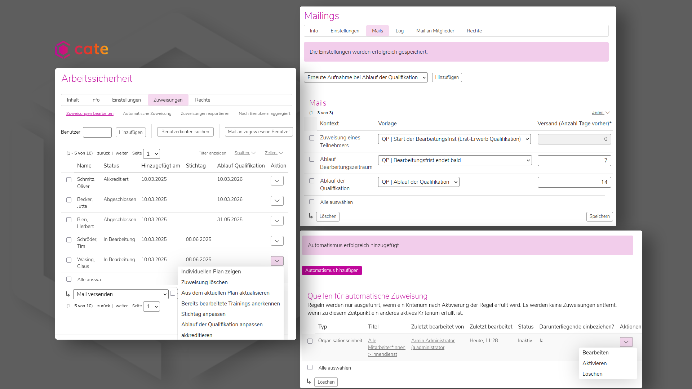
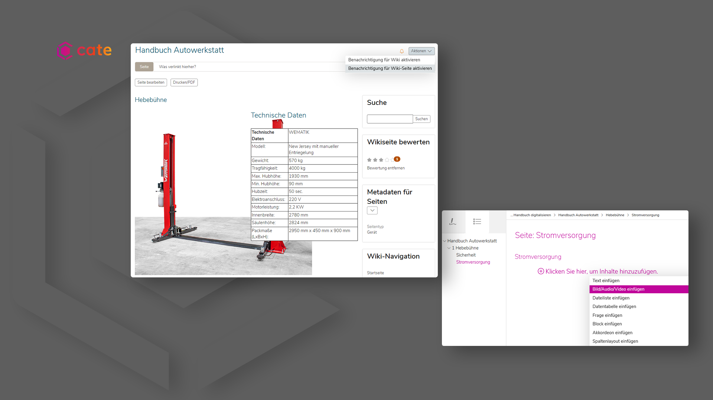
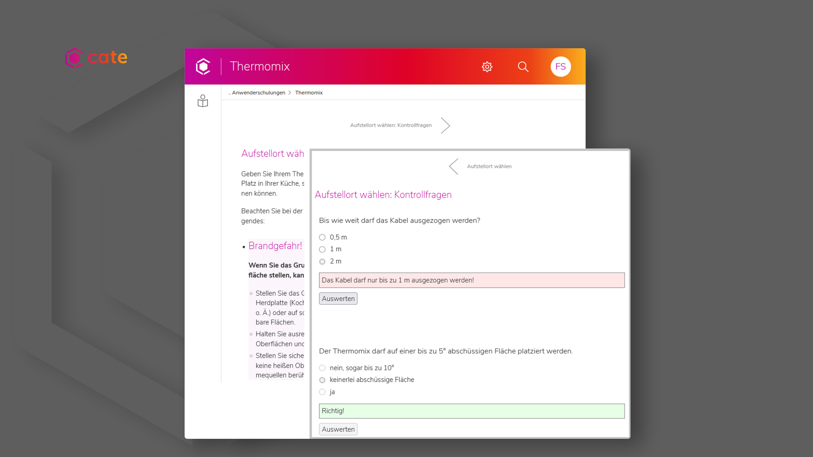

---

marp: true
theme: cat-theme-dark
paginate: false
header: Webinar - Digitalisierung für KMU 
footer: CaT Concepts and Training GmbH

---

<!-- _class: title -->

## **Was bringt das eigentlich?**

# **Digitalisierung für KMU**

---

<!-- _class: chapter -->
## **Agenda**

---

---

### Was machen wir?

* Digitalisierung in KMU
* Wie kann ich Digitalisierungsentscheidungen vernünftig fällen?
* Wie funktioniert diese Bewertung anhand eines Beispiels?

---

### Wer redet?

* Richard Klees
* Geschäftsführung CaT Concepts and Training GmbH
* IT und Organisationsentwicklung
* CaT ist KMU, Kontakte mit Kunden

---
<!-- _class: chapter -->

### **Was ist das eigentlich?**

## **Digitalisierung?**

---

### Digitalisierung: Hilft das Wort?
* Was mit Computer und Software machen?
* Umwandeln von analogen Werten in digitale?
* Verwendung von Daten und Algorithmen für Verbesserungen?
* Aber was heißt das konkret?

---

### Welche Bewertungskriterien kann ich verwenden?

* Unmengen von Produkten und Möglichkeiten
* Anforderungen und Features ebenso ...
* Kosten für Einkauf und/oder Betrieb
* Was wollen wir den eigentlich?

---

### Bewertungskriterium: Digitalisierungsgrad

* Wie digital soll der Prozess werden?
* Unterstützung:
    - alles bleibt im Grunde wie vorher
    - aber Teile/Schritte werden digital
* Neugestaltung:
    - Prozess wird neu gedacht
    - Daten und Algorithmen sind nicht wegzudenken
* Wollen wir einen alten Prozess behalten oder einen neuen bauen?

---

### Bewertungskriterium: Motivation

* Warum soll digitalisiert werden?
* Effizienz:
    - Ergebnisse sollen gleich bleiben
    - aber viel effizienter erreicht werden
* Verbesserung:
    - eine neue Qualität erreichen
    - einen neuen Bereich erschließen
* Wollen wir mehr oder weniger machen?

---

<!-- _class: chapter -->

## **Digitalisierungsentscheidungen verstehen**

---

<!-- _class: chapter -->

---

<!-- _class: chapter -->
### **Digitalisierung am Beispiel**

## **Lernen im Unternehmen**

---

### Beispiel: Lernen im Unternehmen

* Pflichtschulungen
* Mitarbeiterentwicklung
* Onboarding
* Training on the Job
* Wissenstransfer
* ...

---

<!-- _class: chapter -->

## **Pflichtschulungen digitalisieren?**

---

<!-- _class: chapter -->

---

### Pflichtschulungen digitalisieren?

* Ausgangslage: Menschen werden persönlich zu Vor-Ort-Veranstaltung eingeladen
* Können wir eine Effizienzsteigerung mit digitaler Unterstützung erreichen?
* zum Beispiel:
    - Einladung per Mail
    - Meeting per VC
    - Dokumentation der Teilnahme im LMS
* Kernfrage: Werden die Kosten dadurch gesenkt?

---

---

<!-- _class: chapter -->

## **Onboarding digitalisieren?**

---

<!-- _class: chapter -->

---

### Onboarding digitalisieren?

* Ausgangslage: Neueinsteiger\*innen gehen verschiedene Stationen im Unternehmen ab
* Können wir eine Effizienzsteigerung durch Digitalisierung erreichen?
* zum Beispiel:
    - Onboarding-Prozess im LMS abbilden
    - Videos statt Präsenz
    - Nachverfolgung
* Kernfrage: Welche Ressourcen werden frei?

---

---

<!-- _class: chapter -->

## **Handbuch digitalisieren?**

---

<!-- _class: chapter -->

---

### Handbuch digitalisieren?

* Ausgangslage: technische Dokumentation liegt in Form eines gedruckten Handbuchs vor
* Können wir mit digitaler Unterstützung etwas besser machen?
* Idee: Handbuch als Wiki im LMS anlegen!
    - ... ist durchsuchbar.
    - ... ist aktuell.
    - ... alle können beitragen.
* Kernfrage: Welche Verbesserungsmöglichkeiten werden durch digitale Unterstützung erschwinglich?

---

---

<!-- _class: chapter -->
## **Anwenderschulungen digitalisieren?**

---

<!-- _class: chapter -->

---

### Anwenderschulungen digitalisieren

* Ausgangslage: Vertriebsmitarbeitende zeigen die Handhabung der Produkte vor Ort
* Können wir durch Digitalisierung etwas besser machen?
* Idee: Gamifizierte Schulungsreihe anbieten!
    - ... wird jederzeit und immer wieder angesehen.
    - ... nachvollziehbare und steuerbare Qualität.
    - ... niedrige Einstiegshürde.
* Kernfrage: Wird sich eine Investition in die Digitalisierung am Ende lohnen?

---

---

<!-- _class: chapter -->

## **Wrap-Up**

---

### Wrap-Up

* Was soll durch Digitalisierung erreicht werden?
* erst dann: Anforderungen, Features, Kosten
* Digitalisierung kann:
    - bestehendes effizienter machen
    - neue Möglichkeiten erschließen
    - das gleich anders erreichen
    - einen Prozess komplett umkrempeln

---

### Zeit für Fragen

---

### Kontakt
richard.klees@concepts-and-training.de
 

### Weitere Informationen finden Sie hier:

https://cate-lms.de
https://concepts-and-training.de

---

<!-- _class: chapter -->
### **Viele Wege führen nach Rom.**

## **Digitalisierung für KMU**

